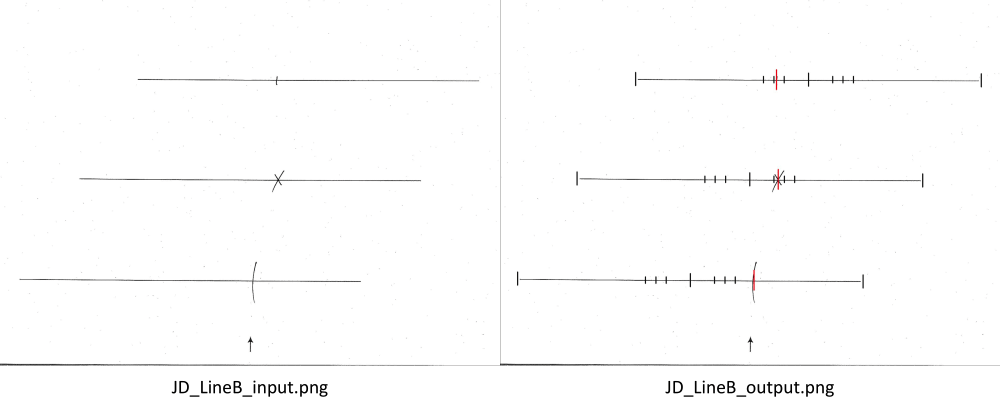

# BITC-Evaluation-Automation

## Description
The Behavioural Inattention Test (BIT) is a battery of tasks used to screen for unilateral neglect in stroke patients. The BIT Conventional subtest (BITC) consists of 6 tasks: line crossing, letter cancellation, star cancellation, figure and shape copying, line bisection, and representational drawing. This paper-pen test currently requires tedious manual scoring. Certain metrics, such as the horizontal and vertical centres of cancellation, can be especially time-consuming to determine using only a ruler and calculator. Others, like the form, detail, and arrangement scores for the figure and shape copying task, rely on somewhat subjective scoring criteria that can lead to inconsistent scoring across evaluators. This project seeks to streamline and standardize this process by using computer vision techniques to automate the evaluation of the first 5 tasks of the BITC.

## Installation
This project requires Python 3.10+ and 5 Python libraries: NumPy, OpenCV, pandas, scikit-image, and scikit-learn. After installing the necessary libraries, git clone this repository to your local machine.

...more info on OpenCV...

## Components
In the BIT-Screening-Automation directory, there are four main subdirectories: diagnostics, templates, patients, and example.

1. The diagnostics subdirectory contains the 8 Python files that do the automatic scoring of the tasks: line_crossing_template.py, line_crossing.py, letter_cancellation.py, star_cancellation.py, star_copying.py, diamond_copying.py, flower_copying.py, and line_bisection.py. Take a look at these files if you wish to understand the scoring process or adjust any of the thresholds. Refer to Tasks below for a written description and example of each of the tasks and their corresponding Python scripts.
2. The templates subdirectory contains a png and pdf version of the template for each of the five tasks. Assess patients using printed copies of these templates and black pen for optimal program performance. Note: the StarC_T_Cropped.png and StarC_T_Cropped.pdf are not to be printed out for patient use (cf. StarC_T.png and StarC_T.pdf); they were used for manually determining constants needed for the diagnostics/star_cancellation.py script. Refer to the diagnostics/star_cancellation.py description below for more information.
3. The patients subdirectory is to be filled in by you and will contain all of the raw scans that are to be automatically evaluated. Refer to step 1 of Usage below for more guidance.
4. The example subdirectory contains an example input and output image for each of the tasks for an imaginary patient, JD. Also included are comparison images which have the input and output images side-by-side for aided visualization of the automated evaluation of the tasks. These comparison images are shown in Tasks below as they become relevant, so there is no need for you to ever enter this example subdirectory.

Also in the BIT-Screening-Automation directory is the create_csv.py file. This is the only Python file you will have to open and is used to generate a patients.csv file within the same directory that contains the automatic scoring data for each of your patients. Refer to step 2 of Usage below for more guidance.

## Usage
1. Once you have cloned the BIT-Screening-Automation directory, the first step is to fill the patients subdirectory. For each of your patients, use their pseudonym to title a new subdirectory within the patients subdirectory and then add scans of their completed tasks that you wish to be automatically evaluated. The files within must be named according to their task as follows: LineC for line cancellation, LetC for letter cancellation, StarC for star cancellation, Copy for figure and shape copying, and LineB for line bisection with either a png, jpg, or jpeg extension (e.g., LineC.png). JD and duplicates of their input files are included as an example of a properly set-up patient; feel free to remove this subdirectory whenever you want.
2. Once all of your patient files are properly set up in the patients subdirectory, open the create_csv.py file within the BIT-Screening-Automation directory. First, edit the pathname on line 13 to be the path to your cloned BIT-Screening-Automation directory (e.g., "/Users/rylandonohoe/Downloads/BIT-Screening-Automation"). Then, run the file to generate a patients.csv file within the same directory. This patients.csv file contains the automatic scoring data for each of the patients you put in the patients subdirectory. Depending on how many of the 5 files you included for each patient, up to 41 metrics are filled in next to each pseudonym; refer to the create_csv.py file to understand the meaning behind each score.

## Tasks

### 1. Line Crossing Task

#### Overview:
Patients are required to detect and cross out all target lines on a page. The examiner demonstrates the task by crossing out two of the four lines located in the central column. The patient is then instructed to cross out all the lines they can see on the page. After the patient completes the task, the number of crossed-out lines not in the central column are counted. The maximum score is 36 (18 left, 18 right). Refer to templates/LineC_T.png or templates/LineC_T.pdf for a template of the task.

#### diagnostics/line_crossing_template.py description:
A scan of the template for the line crossing task (templates/LineC_T.png) is read and preprocessed to reduce noise and emphasize target lines. The centroid coordinates of relevant detected contours are stored and carefully merged to remove instances of target lines being represented by more than one centroid. The arrow centroid is also isolated and subsequently used to orient the image. The centroids of the four lines in the central column are removed from the final list of centroid coordinates. The constant variable, LineC_T_C1, stores this final list of centroid coordinates (i.e., the centres of each target line) and is passed on to line_crossing.py.

#### diagnostics/line_crossing.py description:
A scan of the patient's completed line crossing task is read and heavily preprocessed to emphasize line intersection points. Once again, the centroid coordinates of relevant detected contours are stored and carefully merged to remove instances of line intersection points being represented by more than one centroid. The arrow centroid is again isolated and used to orient the image. The centroid coordinates are then cross-referenced against LineC_T_C1 to determine which target lines were detected. The target lines are post-processed to determine the number of crossed-out lines on the left and right sides (LineC_LS, LineC_RS), the total number of crossed-out lines and its corresponding standard value (LineC, LineC_SV), and the resulting horizontal and vertical centres of cancellation (LineC_HCoC, LineC_VCoC).

#### Example:
When running diagnostics/line_crossing.py on patients/JD/LineC.png, denoted here as JD_LineC_input.png, the following tuple representing (LineC_LS, LineC_RS, LineC, LineC_SV, LineC_HCoC, LineC_VCoC) is outputted: (8, 18, 26, 7.5, 0.32, 0.01). 8/18 target lines were detected on the left side, 18/18 on the right side, and therefore 26/36 in total, corresponding to a standard value of 7.5/10.0. On a scale from -1.00 to 1.00, the horizontal and vertical centres of cancellation are 0.32 and 0.01, respectively. The JD_LineC_output.png image, written from the scoring_img variable in the post_processing function of diagnostics/line_crossing.py, provides a visualization of the result.

### 2. Letter Cancellation Task

#### Overview:
Patients are required to detect and cross out all Es and Rs within a rectangular block of text on a page. After the patient completes the task, the number of crossed-out Es and Rs are counted. The maxmimum score is 40 (20 left, 20 right). Refer to templates/LetC_T.png or templates/LetC_T.pdf for a template of the task.

#### diagnostics/letter_cancellation.py description:
A scan of the patient's completed letter cancellation task is read and preprocessed to reduce noise. The arrow contour is isolated among all detected contours and its centroid is used to orient the image. The image is then cropped to narrow in on the rectangular block of text and further denoised. The text block is precisely isolated by detecting its four corners and using them to apply a perspective transform onto a standardized image size. Treating the letters within the text block as a grid, the positions of the Es and Rs were determined manually which are used to isolate each letter within its own small image. These images are processed to remove as many irrelevant contours as possible and to centre the letter in a new image of standardized size. The contours, contour holes, and diagonal lines of each image are then used to determine which target letters were detected by the patient. The target letters are post-processed to determine the number of crossed-out letters on the left and right sides (LetC_LS, LetC_RS), the total number of crossed-out letters and its corresponding standard value (LetC, LetC_SV), and the resulting horizontal and vertical centres of cancellation (LetC_HCoC, LetC_VCoC).

#### Example:
When running diagnostics/letter_cancellation.py on patients/JD/LetC.png, denoted here as JD_LetC_input.png, the following tuple representing (LetC_LS, LetC_RS, LetC, LetC_SV, LetC_HCoC, LetC_VCoC) is outputted: (7, 19, 26, 6.5, 0.32, -0.06). 7/20 target letters were detected on the left side, 19/20 on the right side, and therefore 26/40 in total, corresponding to a standard value of 6.5/10.0. On a scale from -1.00 to 1.00, the horizontal and vertical centres of cancellation are 0.32 and -0.06, respectively. The JD_LetC_output.png image, written from the scoring_img variable in the post_processing function of diagnostics/letter_cancellation.py, provides a visualization of the result.

### 3. Star Cancellation Task

#### Overview:
Patients are required to detect and cross out all small stars on a page strewn with small stars, big stars, and letters. After the patient completes the task, the number of crossed-out small stars are counted, not including the two small stars in the central column. The maximum score is 54 (27 left, 27 right). Refer to templates/StarC_T.png or templates/StarC_T.pdf for a template of the task.

#### diagnostics/star_cancellation.py description:
A scan of the patient's completed star cancellation task is read and preprocessed to reduce noise and erode the white background. The arrow contour is isolated among all detected contours and its centroid is used to orient the image. The image is then cropped based on the centroid of the rotated arrow contour to narrow in on the ROI. The ROI is precisely isolated by detecting four points that can be consistently identified across all patient scans and using them to apply a perspective transform onto a standardized image size. The coordinates of the target points used to define the perspective transform matrix were manually determined from templates/StarC_T_cropped.png (i.e., the ROI of templates/StarC_T.png). The coordinates of the 54 small stars were also manually determined from templates/StarC_T_cropped.png and used to isolate each small star within its own small image. These images are processed to remove as many irrelevant contours as possible and to rotate and centre the small star to standardize its orientation and position. The contours, skeleton, corners, slant, and other morphological features of each image are then used to determine which small stars were detected by the patient. The target stars are post-processed to determine the number of crossed-out small stars on the left and right sides (StarC_LS, StarC_RS), the total number of crossed-out small stars and its corresponding standard value (StarC, StarC_SV), and the resulting horizontal and vertical centres of cancellation (StarC_HCoC, StarC_VCoC).

#### Example:
When running diagnostics/star_cancellation.py on patients/JD/StarC.png, denoted here as JD_StarC_input.png, the following tuple representing (StarC_LS, StarC_RS, StarC, StarC_SV, StarC_HCoC, StarC_VCoC) is outputted: (10, 25, 35, 6.0, 0.31, -0.07). 10/27 target stars were detected on the left side, 25/27 on the right side, and therefore 35/54 in total, corresponding to a standard value of 6.0/10.0. On a scale from -1.00 to 1.00, the horizontal and vertical centres of cancellation are 0.31 and -0.07, respectively. The JD_StarC_output.png image, written from the scoring_img variable in the post_processing function of diagnostics/star_cancellation.py, provides a visualization of the result.

### 4. Figure and Shape Copying Task

#### Overview:
Patients are required to copy three simple drawings (i.e., a four-pointed star, a diamond, and a flower) from the left side onto the right side of a page. For each drawing, 1 point is each awarded for the correct rendering of the shape, the detail, and the arrangement of the drawing for a maximum of 3 points. The maximum score is 9 points (3 for each drawing). Refer to templates/Copy_T.png or templates/Copy_T.pdf for a template of the task.

#### diagnostics/star_copying.py description:
A scan of the patient's completed figure and shape copying task is read, cropped to narrow in on the star drawing, and preprocessed. Detected corners are then merged, filtered, reduced to a count of 8 if necessary, and finally sorted by ascending angle in standard position. An ideal star is constructed by drawing line segments between consecutive corners of the final list of sorted corners. The overlap between the patient's star drawing and the ideal star is evaluated by defining points along each line of the ideal star, forming short perpendicular lines at each defined point, and subsequently searching for any overlapping black pixels from the patient's star drawing along these perpendicular lines to determine which defined points are valid. A line of the ideal star is deemed valid if a sufficient number of its points are valid. The sorted corners and valid lines are post-processed to determine the shape, detail, and arrangement scores (CopyStar_S, CopyStar_D, CopyStar_A), along with the total score and its corresponding standard value (CopyStar, CopyStar_SV).

#### diagnostics/diamond_copying.py description:
A scan of the patient's completed figure and shape copying task is read, cropped to narrow in on the diamond drawing, and preprocessed to reduce noise and simplify the drawing. Detected lines are filtered to remove lines that are not part of the patient's diamond drawing. An ideal diamond is constructed by drawing line segments between consecutive points of the topmost, rightmost, bottommost, and leftmost corners of the filtered lines as well as between the topmost and bottommost corners for the vertical line. If the leftmost or rightmost corners are incompletely drawn by the patient, the point is extrapolated to represent the intended angle. The overlap between the patient's diamond drawing and the ideal diamond is evaluated by defining points along each line of the ideal diamond, forming short perpendicular lines at each defined point, and subsequently searching for any intersection with a line from the patient's diamond drawing along these perpendicular lines to determine which defined points are valid. A line of the ideal diamond is deemed valid if a sufficient number of its points are valid. The corners and valid lines are post-processed to determine the shape, detail, and arrangement scores (CopyDiamond_S, CopyDiamond_D, CopyDiamond_A), along with the total score and its corresponding standard value (CopyDiamond, CopyDiamond_SV).

#### diagnostics/flower_copying.py description:
...

#### Example:
...

### 5. Line Bisection Task

#### Overview
Patients are required to bisect three horizontal lines on a page. After the patient completes the task, the deviation of the patient's subjective centre from the actual centre of each line is objectively evaluated. The maximum score is 9 (3 per line). Refer to templates/LineB_T.png or templates/LineB_T.pdf for a template of the task.

#### diagnostics/line_bisection.py description:
A scan of the patient's completed line bisection task is read and heavily preprocessed to reduce noise and emphasize line bisections. The centroid coordinates of relevant detected contours are stored and used to merge nearby contours. The merged contours are further filtered to retain only line bisection contours and then processed to reduce shape complexity. The arrow contour is also isolated among the merged contours and its centroid is used to orient the image. The 25 topmost, rightmost, bottommost, and leftmost points of each line bisection contour are used to define representative points for the left edge, bisection, and right edge for each of the three line bisections. These points are post-processed to visualize and score from 0–3 the deviation of the patient's subjective centre from the actual centre of the top, middle, and bottom lines (LineB_T, LineB_M, LineB_B). An 'L' or 'R' is also appended to each of these scores to indicate whether the deviation was to the left or right. The overall score out of 9 and its corresponding standard value are then determined (LineB, LineB_SV), along with the resulting horizontal centre of cancellation (LineB_HCoC).

#### Example:
When running diagnostics/line_bisection.py on patients/JD/LineB.png, denoted here as JD_LineB_input.png, the following tuple representing (LineB_T, LineB_M, LineB_B, LineB, LineB_SV, LineB_HCoC) is outputted: ('2L', '2R', '0R', 4, 4.0, 0.12). The top bisection scored 2/3 and was deviated to the left, the middle bisection scored 2/3 and was deviated to the right, the bottom bisection scored 0/3 and was deviated to the right, and therefore 4/9 was the total score, corresponding to a standard value of 4.0/10.0. On a scale from -1.00 to 1.00, the horizontal centre of cancellation was 0.12. The JD_LineB_output.png image, written from the scoring_img variable in the post_processing function of diagnostics/line_bisection.py, provides a visualization of the result.

